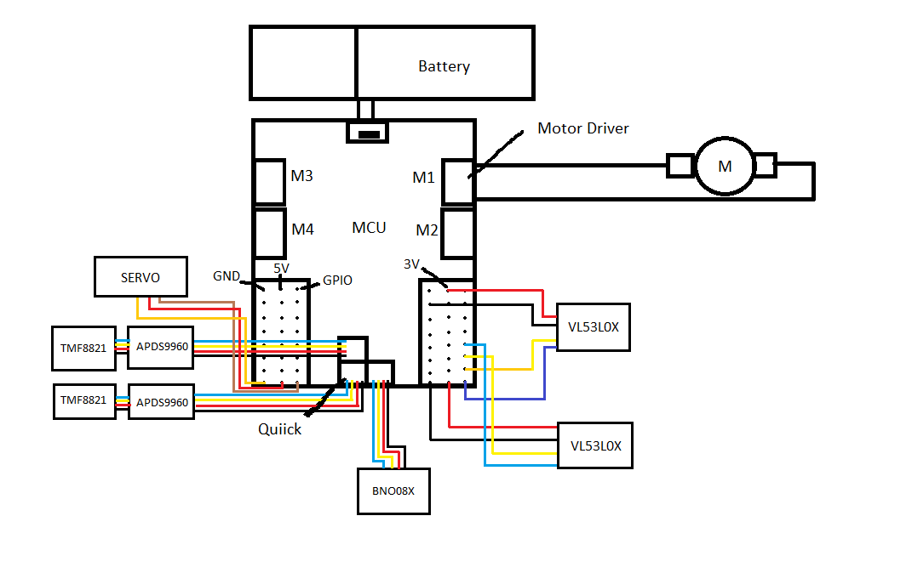

# Electrical Design 

In this document you'll find all the things about the electrical components like the capacity of the sensors, the battery, and how is designed the electrical on the robot.

## Introduction
Our electrical design consists of the amount of 8 sensors, with which our car is capable of flawlessly driving through the track without much difficulty. The sensors of our choice are: 2 TCS3472-TMF8821 sensors on the front for effective color detecting and distance reading, some TMF8821 distance sensors on each side for mantaining the car as centered through the track, a HuskyLens 2 camera in the front for better color detection, and lastly our BMI270 IMU which we will use to make the car know where it is at and where is headed to. The powerful brain here is a MOTION PRO RP2350 which programmed in micropython is more than capable of handling every sensor on the list. Our drive hardware consists of the trusty TT motor for driving and a sturdy MG996r servo motor for steering. But this is too simple right? Just using some generic hardware to make our car drive is too basic for us engineers? Well of course, we can do more, we can do better, and thats why we are designing our own sensors for future competitions. As a matter of fact we ALREADY have the schematics for a mix of the powerful TCS and TMF sensors (designed by us) in one board and we plan on making the best hardware we can for our needs in this competence. 

## Battery
The battery it's a JUOVI power bank that has a capacity of 37W/h and can supply 35W continuos, with a capacity of 10,000mAh and includes dual USB Type-C ports and one USB-A port. 

## How much the sensors consume?
- MOTION PRO RP2350 (microcontroller) = Normal Run: Approximately 22mA.

- TMF8821 (distance sensor) = Active Current Consumption: ~57 mA.

- TCS3472 = 235mA to 330mA (operating at 3V)

- BMI270 (accelerometer + gyroscope (MaxODR)) = 685mA

- HuskyLens 2 = 1.5W to 3W (operating at 3.3V or 5.0V)

- MG996r (servo) = Operating Current (Under Load): 500mA - 900mA.

- TT motor = At 6VDC: 160mA @ 250 RPM no-load, and 1.5 Amps when stalled.

## Electrical Diagram 

## Robot Composition 

The robot is composed of 8 sensors that are distributed in all the robot. These sensors help the robot to know where he goes, what he have to do, and when he have to stop. Sensors are, in few words, the eyes, hands, and ears of the robot. 

The chosen sensors for the robot were:

| Sensor | Brief Description | Specifications | Library |
|--------|-------------------|----------------|---------|
|TMF8821| Distance Sensor | [ams TMF8821 configurable 4x4 multi-time dToF](https://ams-osram.com/products/sensor-solutions/direct-time-of-flight-sensors-dtof/ams-tmf8821-configurable-4x4-multi-zone-time-of-flight-sensor)| [tmf8821.py](Code-Development/lib/tmf8821.py) |
|TCS3472| Color Sensor | [TCS3472 Datasheet](https://cdn-shop.adafruit.com/datasheets/TCS34725.pdf) | [tcs3472.py](Code-Development\lib\tcs3472.py) |
|BMI270| IMU Sensor |  [BMI270 Datasheet](https://www.bosch-sensortec.com/media/boschsensortec/downloads/datasheets/bst-bmi270-ds000.pdf) | [bmi270.py]()
|HuskyLens 2| Advanced Smart AI Vision Sensor | [HuskyLens](https://wiki.dfrobot.com/sen0638/) | [huskylens2.py](Code-Development\lib\pyhuskylens.py)
|Cytron Motion Pro RP2350| Microcontroller | [Cytron Motion Pro RP2350 Datasheet](https://www.cytron.io/p-motion-2350-pro?srsltid=AU7gw4W5Ifi1J22W_zTflltF3oPrDEIvFmEJ27_g_rW_nqw14TCFXhvm)

## Our System!

<table>
  <thead>
    <tr>
      <th width="20%"> Hardware</th>
      <th width="45%"> What it is?</th>
      <th width="45%"> Why we decide to use it
    </tr>
  </thead>
  <tbody>
    <tr>
      <td><b> TMF8821 </b></td>
      <td>
        

          
 Description (Click to expand) 

          
 The ams OSRAM TMF8821 is a compact multi-zone direct Time-of-Flight (dToF) optical sensor measuring precise distances from 10 mm to 5,000 mm at up to 30 Hz. Housed in a tiny 4.6 mm x 2.0 mm x 1.4 mm package, it integrates a 940 nm Class 1 eye-safe VCSEL, a high-sensitivity SPAD array, and on-chip histogram processing to support configurable 3x3, 4x4, or 3x6 grids with a 63° field of view. Communicating over I²C, this high-performance module features sunlight immunity and dynamic cover glass calibration, making it ideal for smartphone laser autofocus, presence detection, and robotics. 

        

      </td>
      <td>
      

          
 Description (Click to expand) 

          
 We decide to use the TMF8821 distance sensor for the robot. Why we choose this? Well, after using other distance sensors like the  Vl53l0x and the Vl53l1x (V-1.4 and past versions), or the hcsr04 distance sensor (V-1.3 and past versions), the one who give us better results in reading distance it was the TMF8821. It ensures better lectures than the others, specifically better lectures when its time to read the black walls of the circuit. For this reason, we decided to keep and use the TMF8821 in the robot, seeking for the best lectures and more accuracy. 

        

      </td>
    </tr>
    <tr>
      <td><b> TCS3472 </b></td>
      <td>
        

          
 Description (Click to expand) 

          
The TCS3472 is a high-precision digital color light-to-digital converter featuring a 3×4 photodiode array and four integrated 16-bit analog-to-digital converters for simultaneous RGBC measurement. Equipped with an on-chip infrared blocking filter and an I²C interface, it enables accurate chromaticity analysis and ambient light sensing under varying illumination conditions.

        

      </td>
      <td>
        

          
 Description (Click to expand) 

          
For the color sensor we decided to use the TCS3472 for the robot. In the past, we were using the APDS9960 (V-1.4 and past versions), but in some tests, we seen that some lectures were not accurate and the robot get confused with the colors, making the computer take bad decisions. Because of this, in this new version we changed to the TCS3472 to secure more accurate lectures. The TCS3472 provide us lecture more precise and that helps the computer to identify the colors faster, precise and take better decisions.

        

      </td>
    </tr>
    <tr>
      <td><b> BMI270 </b></td>
      <td>
        

          
 Description (Click to expand) 

          
 The BMI270 is an ultra-low-power, 6-axis Inertial Measurement Unit (IMU) developed by Bosch Sensortec that combines a 16-bit triaxial accelerometer and a 16-bit triaxial gyroscope into a compact 2.5 x 3.0 mm package. Operating at a low current consumption of approximately 685 µA, it features advanced, on-chip smart motion intelligence for plug-and-play step counting, activity recognition, and wrist gesture detection. Optimized for wearable tech, it is widely used in smartwatches, fitness trackers, hearables, and AR/VR controllers. 

        

      </td>
      <td>
        

          
 Description (Click to expand) 

          
 In process 

        

      </td>
    </tr>
    <tr>
      <td><b> HuskyLens 2 </b></td>
      <td>
        

          
 Description (Click to expand) 

          
 The HuskyLens 2 is a high-performance edge-AI vision sensor powered by a dual-core RISC-V processor with a 6 TOPS AI accelerator for real-time, on-device image processing without internet or PC dependence. Featuring a 2.4-inch touchscreen and a 60 FPS camera, it supports over 20 pre-installed AI functions—like face recognition, gesture sensing, and line tracking—while seamlessly connecting to Arduino, micro:bit, and Raspberry Pi via I2C/UART. 

        

      </td>
      <td>
        

          
 Description (Click to expand) 

          
 In one of our brainstormings, the idea of use a camare surge, and, with this, the doubt of use or not use a camera stay there for a long time. One day one of our members appeared with the HuskyLens 2, and since we already had it, why not use it. The HuskyLens 2 provide us exceptional features like line tracking, color detection, object detection, and other features that can be really useful to complete all the challenges. As a result, we decide to improve and add this complex camera to our robot, to make sure the decisions would be flawless. 

        

      </td>
    </tr>
    <tr>
      <td><b> Cytron Motion Pro RP2350 </b></td>
      <td>
        

          
 Description (Click to expand) 

          
 The Cytron MOTION 2350 Pro is a beginner-friendly robotics controller powered by the dual-core Raspberry Pi RP2350 microcontroller, operating between 3.6V and 16V. Designed for rapid prototyping, it drives up to 4 brushed DC motors (3A continuous/5A peak) and 8 servos, while featuring 3 Maker Ports, an onboard USB-A host port for gamepads, and physical quick-test buttons for no-code hardware testing. It comes preloaded with CircuitPython and fully supports MicroPython, C/C++, and Arduino IDE, making it a highly accessible all-in-one solution for building mobile robots and smart hardware projects. 

        

      </td>
      <td>
        

          
 Description (Click to expand) 

          
 Of all the microcontroller we could have choosen, we decided to go with the Cytron Motion Pro RP2350. This microcontroller provide us more than we need; it's a fast, precise, and easy to use microcontroller, guaranteeing us that all the information would be processed and analyzed to take the refined decisions. 

        

      </td>
    </tr>
  </tbody>
</table>
