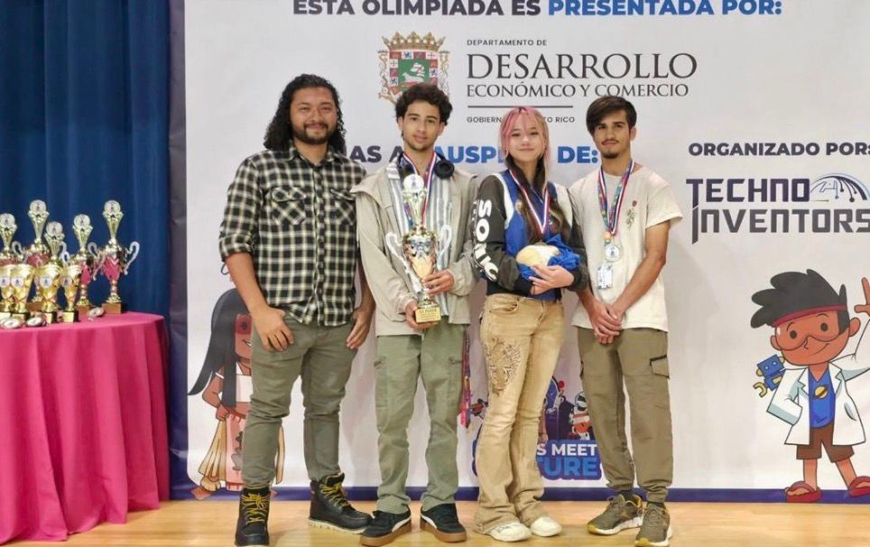
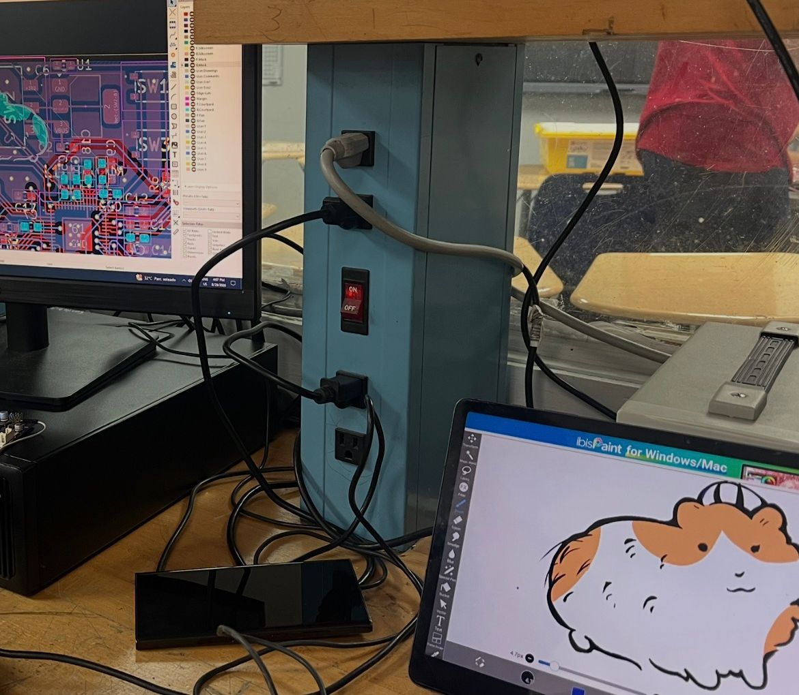

# WRO_EATCHIWI_PR_2026

This repository contains the documentation of the team EatChiwi on the challenge of creating a self-driving vehicle. Here you're going to find all about the creation of the vehicle: mechanical parts, programation, and system thinking. 

Our Ticket to the Internationals! (2026)
===

## Introduction:

Welcome to Team EatChiwi, competing in the Future Engineer's category! Our challenge is to design and program a self-driving car. While building the hardware from scratch wasn't a requirement, we wanted to push our limits. We designed, manufactured, and assembled our entired vehicle from the ground up using 3D printed materials, running on our own custom software. In this process, our dedication was the key to keep pushing forward. In this repository, you'll find our story, our background, and learn more about the whole process of how we create our vehicle. 

### <U>[Table of Content!](#table-of-content-)</U>

Team Photo (from left to right)
===
- Efrain Ortiz (18) - current freshman (college) and our trusted mechanic. Responsible of the creation of the models of the vehicle and the car itself. He's a real innovator and main strategist.
- Faneshka Cartagena (18) - current senior and is the person dedicated to take note of everything. She's a very dedicated and creative person. Responsible of all the documentation of the creating and thinking process. 
- Jose Ortiz (17) - current senior and the programmer of the group. Responsible of the creation of the program of the vehicle and the one in charge to make the strategy come to life.

<table>
    <tr> 
        <td> 
        </td> 
        <td> 
        </td>
        </tr>
    </table>

### 
 <U> [Learn more about us!](T-Photo\README.md) </U> 

Our team's Mascot!
===
Meet our team’s mascot, Chisgüys herself, our lucky charm!
(Ignore what we’re working on in the back.)

<table>
    <tr> 
        <td> 
        </td> 
        <td> 
        </td>
        </tr>
    </table>

Vehicle Photo
===
## V-1.5 (Sept/12/26)

<table>
    <tr> 
        <td> 

        <!-- Image -->
         
  <!-- The Text Overlay -->
  

    <b> Bottom </b>
  

        </td> 
        <td> 

        <!-- Image -->
         
  <!-- The Text Overlay -->
  

    <b> Back </b>
  

        </td>
        <td> 

        <!-- Image -->
         
  <!-- The Text Overlay -->
  

    <b> Front </b>
  

        </td>
    </tr>
    <tr> 
        <td> 

        <!-- Image -->
         
  <!-- The Text Overlay -->
  

    <b> Left </b>
  

        </td>
        <td> 

        <!-- Image -->
         
  <!-- The Text Overlay -->
  

    <b> Top </b>
  

        </td>
        <td> 

        <!-- Image -->
         
  <!-- The Text Overlay -->
  

    <b> Right </b>
  

        </td>
    </tr>
    </table>
  

## About the Mechanics:

The design of the car it's a compact design created in this way to be more quicker to print and more easy to avoid obstacules. The measurements of the car are: lenght = 25cm, width = 11.5cm, tall = 9cm. The car is RWD drived by a TT motor and a MG996r servo motor for steering. The brain of the car is the microcontroller MOTION PRO RP2350. The car counts with 4 wheels of 51mm, 2 TCS3472 on front, 2 TMF8821 on front, TMF8821 sensors on each side and will have a BMI270 for orientation. On the top, just below the microcontroller it's the battery that have a capacity of 37W/h and can supply 35W continuos and counts with a capacity of 10,000mAh.

## About the Code:

Our robot is an autonomous robot programed to complete the Future Engineer's track. To program the robot, the IDE we use is Thonny. To create the code we're using different libraries and sensors:

- `tmf8821` - EJOM CODE @Dde567
- `servo` - EJOM CODE @Dde567
- `dcmotor` - [dcmotor.py](Code-Development/lib/dcmotor.py)
- `tcs3472` - [tcs3472.py](Code-Development/lib/tcs3472.py)

To upload the code to the microcontroller: connect the microcontroller to your computer using a USB cable. Turn it on, then open your IDE (in our case, Thonny) and make sure the microcontroller is recognized. Press the right click on the program you want to upload and select save. Once saved, the code is successfully uploaded to the microcontroller.

## Table of Content :

| Type | Content | Readme |
|------|---------|--------|
| Mechanics | [CAD](Mechanics/CAD) | [Mobility and Mechanical Design](Mechanics\README.md)|
| Electrical-Design | [Hardware CADS](Electrical-Design/HardwareCADS) / [Electrical Diagram](Electrical-Design/Electrical_Diagram.png) | [Power and Sensor Architecture](Electrical-Design\README.md)|
| Code-Development | [Lib](Code-Development/lib)| [Software Architecture and Obstacle Stategy](Code-Development\README.md) |
| T-Photo | [T-Photo_Normal](T-Photo/Team_Photos/Photo%20Team%20EatChiwi.jpg) / [T-Photo_Crazy](T-Photo\Team_Photos/Photo%20Team%20EatChiwi%20(2).jpg) | [Our Team!](T-Photo/README.md) |
| V-Photo | [V-1.0](V-Photo/V-Photo%20Version_1.0) / [V-1.1](V-Photo/V-Photo%20Version_1.1) / [V-1.2](V-Photo/V-Photo%20Version_1.2) / [V-1.3](V-Photo/V-Photo%20Version_1.3) / [V-1.4](V-Photo/V-Photo%20Version_1.4) / [V-1.5](V-Photo/V-Photo%20Version_1.5)| [Versions of the Car](V-Photo\README.md) |
| Video | [Open Lap for PRNRO 2026 (Team EatChiwi)](https://youtu.be/rVMPH4gbWxk?feature=shared) |||

#### <u>[Back to the top!](#wro_eatchiwi_pr_2026)<u>

